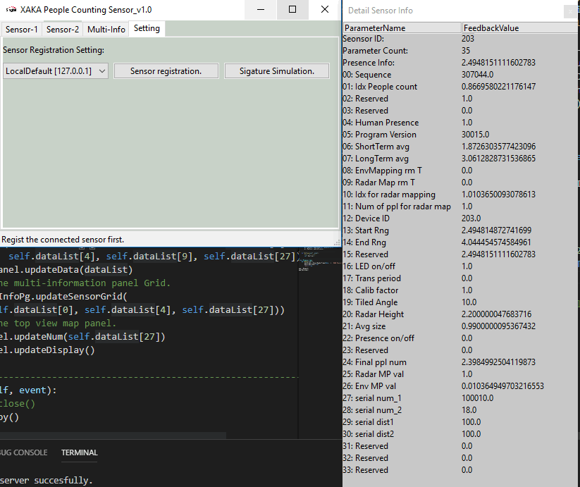

# Xandar_Sensor_App

**Program Design Purpose**: We want to create an application to visualize single/multiple Xandar Kardian people counting sensors detection result for a indoor area. 

[TOC]

### Introduction 

This project is aimed to create an application to visualize single/multiple Xandar Kardian people counting sensors detection result for a indoor area as shown below. 


The application user interface contents chart pages to show the sensor detection history, a top-view of the monitored indoor area to show the people density and a config page for upload the data into the control center. 

Xandar Kardian people counting sensors introduction : https://www.xkcorp.com/

##### Application UI View


`version: v_2.1`


------

### Program Design

The application user interface contents three main pages: 


##### Sensor data visualization dashboard

We will show the current detection people count number, average people count number and finial normalized people count number in a chart with different color lines . We will also list `sensor ID`, `connection interface`, `current data index in data queue` (sequence number) and add a "Pause" button to let the user can stop the UI updating and check the data. When the user press "Detail >>" button, a parameter display panel will show on the right to show the entire 36 parameters can be read from the  Xandar Kardian sensor. 

The user can also switch among different sensors by click the top tab, the data visualization dashboard is shown below: 


##### Top view monitored area visualization dashboard 

We will show a top view map for the monitored indoor area and the connection information of different sensors in this dashboard (Muti-Info tab):


The map is shown on the left, sensor connection and sensor feed back data are shown on the right side. 


##### Control-Hub report config page

If we install several app with multiple sensors in an indoor area we can config a hub and connect all the apps/sensors to report the data to the hub. One app can control max 4 sensors. The user can register the app to the hub with a unique signature. The detail is shown below:



=> Select the control Hub IP you want to connect, create a signature for the current App and click the sensor registration button.  


------

### Program Setup

###### Development Environment : python 3.7.4

###### Additional Lib/Software Need

1. **wxPython** : https://docs.wxpython.org/index.html

   ```
   Install: pip install wxPython
   ```

2.  --

###### Hardware Needed: Xandar Kardian


###### Program Files List 

| Program File            | Execution Env | Description                            |
| ----------------------- | ------------- | -------------------------------------- |
| src/XAKAsensorRd.py     | python 3      | Application main UI frame.             |
| src/XAKAsensorPanel.py  | python 3      | UI function panels module.             |
| src/XAKAsensorComm.py   | python 3      | Sensor communication interface module. |
| src/XAKAsensorGlobal.py | python 3      | Global parameters module.              |
| src/img                 |               | Image folder used by the program       |

version: V_2.1


------

### Program Usage/Execution

###### Program Execution

```
python XAKAsensorRd.py
```


------

### Problem and Solution

N.A

------

### Reference

Xandar Kardian people counting sensors : https://www.xkcorp.com/

------

> Last edit by LiuYuancheng(liu_yuan_cheng@hotmail.com) at 29/01/2022